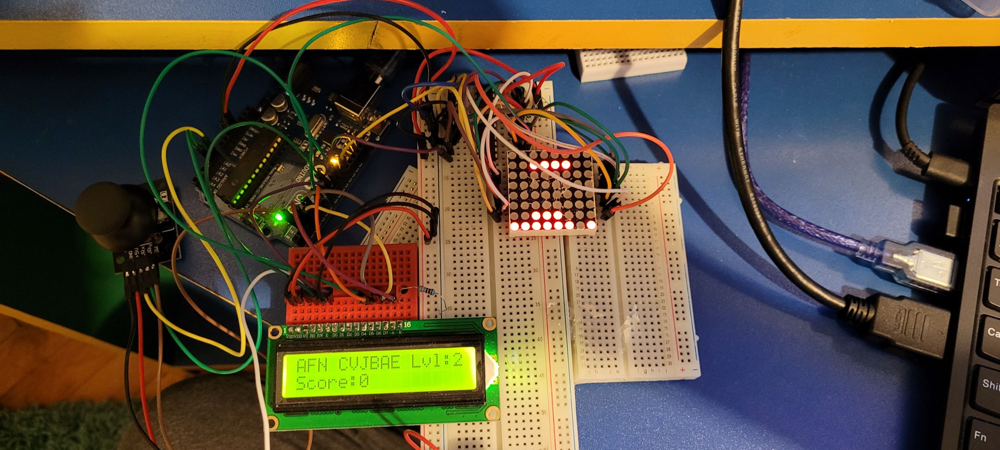
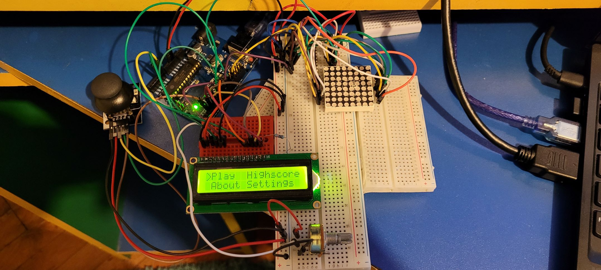

# MatrixProject

In this repository I have a basic implementation of the Tetris game.
Tetris was one of my favourite games growing up, as before the smartphone era
the most accesible way for kids to play video games was on those "brick"
consoles which contained a lot of games, also having my favourite, Tetris.

My implementation in Arduino has all the clasic blocks and follows the game's rules.
When a horizontal line is filled it gets destroyed, the following lines move down
one step and the player gains a point. When a block spawn location is blocked by another piece the game ends.
The game also allows rotation for all blocks except O and I.
 
The player's objective is quite intuitive, try to complete as many horizontal lines
while tring to not overfill the screen (and paying close attention to the center).

The game components are:

Three breadboards (170, 400 and 830 respectively)

A potentiometer

Several wires

An LCD

An Arduino Uno

An 8x8 Matrix display

A MAX7219 driver

A 330 resitor for the LCD

A 100k resistor for the MAX7219

A joytick

[Link to a video showcasing functionality](/https://youtu.be/0VH4JV-nQ9k)

Picture 1: 

Picture 2: 

